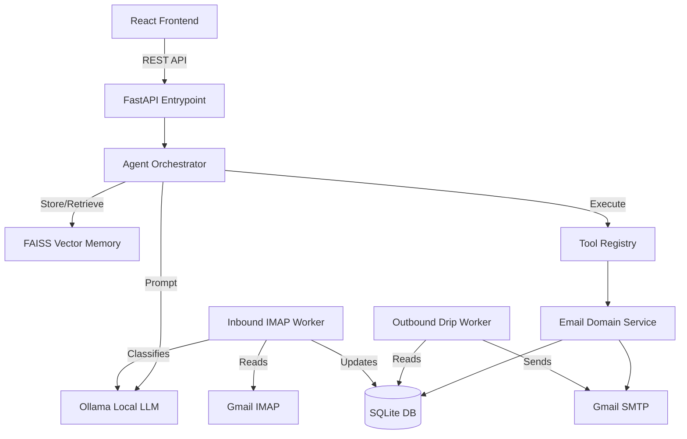

# System Design & Implementation Guide
**SaaS Outreach Engine (Powered by Ollama)**

This document breaks down the entire system architecture, explaining how each component of the application was implemented and how they interact to form a production-grade SaaS product.

---

## High-Level Architecture

The application follows a **Modular Monolith** architecture. This means the backend is a single FastAPI application, but internally it is strictly divided into bounded contexts (domain services). This makes the app easy to deploy while keeping it decoupled enough to split into microservices later if needed.

The system is composed of 3 primary layers:
1. **Frontend (React + Vite + Tailwind CSS)**: The presentation layer.
2. **Backend (FastAPI)**: The API, Agent Orchestration, and Background Workers.
3. **Data Layer (SQLite + FAISS)**: Relational data storage and semantic vector memory.

---

## 1. The Frontend (React + Vite)

The frontend was completely rebuilt to mimic a modern SaaS dashboard. 
- **Framework**: React 19 bootstrapped with Vite for instant Hot Module Replacement (HMR).
- **Styling**: Tailwind CSS v3 using a custom "Glassmorphism" dark theme.
- **Routing**: `react-router-dom` handles navigation between the 4 main views without page reloads.

### Core Views
- **Dashboard (`/`)**: A split view containing the `MetricsDashboard` (showing success rates and intent breakdowns) and the `ChatInterface` (the primary way the user interacts with the AI agent).
- **Leads (`/leads`)**: Fetches from `GET /api/contacts`. Renders an HTML table of the CRM data. Includes a client-side CSV upload feature that posts to `POST /api/leads/upload`.
- **Campaigns (`/campaigns`)**: Displays active campaigns as cards.
- **Templates (`/templates`)**: Renders saved email templates. Features a custom regex parser to syntax-highlight variables like `{{name}}` in cyan.

---

## 2. The Backend Orchestrator (Agent Loop)

The core "brain" of the application lives in `backend/agent/loop.py`. It implements a ReAct-style (Reasoning and Acting) loop without relying on heavy frameworks like LangChain.

### How it works:
1. **User Input**: The user types a command in the frontend chat.
2. **Memory Retrieval**: The `MemoryService` embeds the user's input using `sentence-transformers` and queries the `FAISS` index for the top 3 most semantically similar past interactions. This gives the agent "context" of past conversations.
3. **Prompt Construction**: The agent combines the System Prompt, the available Tool Descriptions, the Memory Context, and the User Input.
4. **LLM Execution**: It sends this to the local Ollama model (`llama3`), enforcing a strict JSON schema output.
5. **Tool Validation**: The output is checked against `TOOL_REGISTRY`. If the LLM hallucinates a tool name, the code catches it and forces the LLM to retry.
6. **Execution**: The requested tools are executed via Python `lambda` functions mapped to the `EmailService`.
7. **Memory Storage**: The interaction is saved back to the FAISS index so the agent remembers it next time.

---

## 3. The Email Domain Service (`services/email/`)

This is the largest bounded context in the app. It handles everything related to CRM and sending/receiving emails.

### A. Database Schema (`models.py`)
Uses `SQLAlchemy 2.0` with SQLite.
- **Contact**: Stores lead data (`email`, `name`, `industry`, `pain_points`, `recent_news`).
- **Template**: Stores reusable email bodies with variables.
- **Campaign**: A logical grouping for an outreach sequence.
- **Email**: The core table. Represents a single scheduled or sent email. Contains a `scheduled_for` timestamp and a `status` (`queued`, `sent`, `failed`, `cancelled`, `paused`).
- **Event**: Tracks analytics (e.g., an incoming reply).

### B. Outbound Drip Worker (`campaigns.py`)
Because sending thousands of emails in a FastAPI request would block the server, we use `APScheduler`.
- **`process_queued_emails` Job**: Runs every 1 minute.
- **Query**: `SELECT * FROM emails WHERE status='queued' AND scheduled_for <= NOW() LIMIT 5`.
- **Deliverability Protection**: 
  - Checks `daily_send_count` against a hard `DAILY_SEND_LIMIT` (e.g., 50).
  - Replaces `{{name}}` and `{{company}}` variables using Python's `.replace()`.
  - Uses `smtplib` to send via Gmail SMTP.
  - Sleeps for a random duration (15-45 seconds) between sends to trick spam filters into thinking a human is typing the emails.

### C. Inbound IMAP Worker (`imap_worker.py`)
A true SaaS platform stops sending follow-ups if a lead replies.
- **`check_replies_job`**: Runs every 5 minutes in APScheduler.
- **Connection**: Uses Python's built-in `imaplib` to connect to `imap.gmail.com` and search for `UNSEEN` emails.
- **Matching**: Extracts the sender's email address and checks if it exists in our `Contact` database.
- **AI Classification**: If it's a known lead, it extracts the email body and sends it to the LLM via `LLMService.classify_reply()`. The LLM categorizes it as `interested`, `not_now`, `unsubscribe`, `referral`, or `ooo`.
- **Auto-Stop**: If a reply is found, the worker runs an `UPDATE` query to set all future `queued` emails for that specific `contact_id` to `cancelled`.

---

## 4. Why This Architecture Was Chosen

1. **Local LLM (Ollama)**: By running the LLM locally, you eliminate OpenAI API costs entirely. This is crucial for an agent that constantly runs background checks and retries failed JSON parses.
2. **SQLite**: Chosen for zero-setup relational data. It handles the CRM load perfectly for a single-tenant SaaS. If multi-tenancy is needed later, simply swapping the SQLAlchemy connection string to PostgreSQL is all that's required.
3. **APScheduler over Redis/Celery**: Standard SaaS apps use Redis and Celery for background queues. However, that requires complex Docker setups. APScheduler runs directly inside the FastAPI memory space, making the app entirely self-contained while still providing robust background processing.
4. **App Passwords over OAuth2**: Google Cloud OAuth2 requires verification, consent screens, and complex token refresh logic. Using Gmail App Passwords allows instant IMAP/SMTP access with 2 lines of code.
